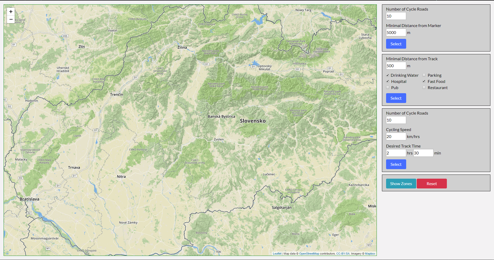
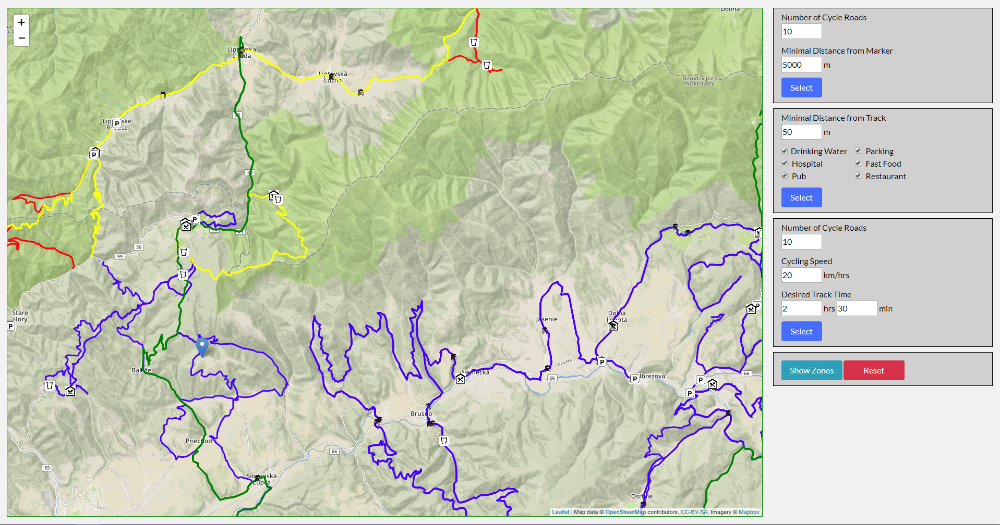

# Overview

This application shows hotels in Bratislava on a map. Most important features are:
- search by proximity to my current location
- search by hotel name
- intelligent ordering - by proximity and by hotel features
- hotels on the map are color coded by their quality assigned in stars (standard)

This application shows Bicycle Tracks in central Slovakia on map. Most important features are:
- Place Marker on a Map and search nearest tracks
- Search Tracks which are near selected amenities
- Show only tracks which can be completed in selected time
- Show nature reserves areas
- Reset map to original state
- Each track has color atribute class which represents ratio of intersection of length in nature reserve to whole length, blue means almost 0 ratio and red means 80% and more
This is it in action:
- Initial State



- Showing some Tracks


The application has 2 separate parts, the client which is a [frontend web application](#frontend) using leaflet API and landing.js and [Bootstrap framework](https://getbootstrap.com). [Backend application](#backend) written in [node.js](https://nodejs.org/en/) with [Express](https://expressjs.com/) framework, backed by PostGIS and Postgresql. The frontend application communicates with backend using a [REST API](#api).

# Frontend

The frontend application is a static HTML page (`landing.ejs`), which shows a leaflet.js widget. It is displaying bicycle tracks. Each track has color class based on the ratio of its length in nature reserve.

All relevant javascript code is in `landing.js` which is referenced from `landing.ejs`. The frontend code is very simple, its only responsibilities are:
- displaying the leaflet map which shows relevant bicycle tracks
- displaying the sidebar panel user can interact with if he wishes to use features described above like Search for tracks which are near selected amenities, or display nature reserves
- Make Requests on Server to get relevant tracks
- Display Tracks on the map which come from server response

# Backend

The backend application is written in node.js and is responsible for querying geo data, formatting the geojson and data for the map.

## Data

Tracks data is coming directly from [Open Street Maps](https://www.openstreetmap.org/#map=8/48.674/19.709). I downloaded an extent covering middle part of Slovakia and imported it using the `osm2pgsql` tool into the standard OSM schema in WGS 84 with hstore enabled. To speedup the queries I created multiple indexes on geometry columns (amenity, route, ST_Length(ST_Transform(way, 4326)::geography)) in tables point and line. The route methods are inside `routes/index.js` which responds to the requests sent by (#frontend). In order to speed up queries some additional collumns were created so they dont need to be calculated each time the request is send (mainly column crossing_area).

## Api

**Find tracks in proximity to marker**

`POST /clicked_nearest`

In body part of request is the information about the minimal distance, maximum number of requested tracks, marker coordinates.

**Find tracks which have selected amenities in area**

`POST /nearest_amenities`

In body part of request is the information about the maximum allowed distance between selected amenity and track and selected amenities.

**Find tracks which have best length for user**

`POST /clicked_length`

In body part of request is the information about the maximal length of the track and the number of desired tracks.

***Show nature reserves***

`GET /clicked_zones`

## Response

API calls return json responses in a array. One record consists of , `tracks` and in query 2 `amenity points`. `Tracks` contains an information about its coordinates and crossing_area. Track attributes are:
```
{
  "track": geojson coordinates,
  "crossing_area": float number, # like 70%
}
```
## Indexes

Before adding indexes I searched for the cost of each query.

***Initial Costs***

- Query1: 21,858.17
- Query2: 15,107	
- Query3: 22,056

***Adding index on route type***

- Query1: 21,717
- Query2: 15,026.47	
- Query3: 21,913

***Adding index on points amenity***

- Query1: 21,717
- Query2: 13,703.66	
- Query3: 21,913

***Adding index on route length***

- Query1: 21,717
- Query2: 13,703.66	
- Query3: 10,179.19 